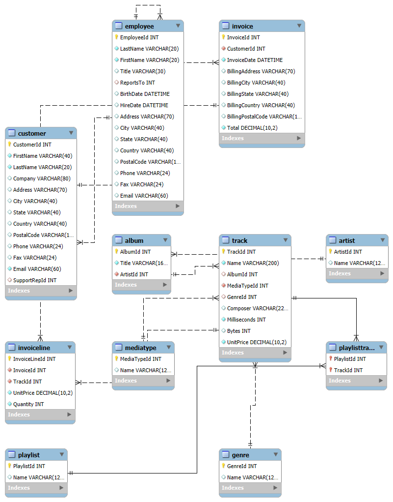

#  Digital Media Store
📊 Digital Media Store (Chinook Database) - SQL &amp; Analytics A complete MySQL database of a digital media store with a full schema, sample data, and a variety of SQL queries for analytics and reporting — from basic to advanced business insights.
# Digital Media Store (Chinook Database) - SQL & Analytics

## 📋 Overview
This repository includes the **Chinook Database**, a sample digital media store database implemented in **MySQL**. It comes with:
- Full database creation and data population script.
- A set of **25+ analytical SQL queries** ranging from basic to advanced.
- A visual schema of the database.
- Time-based and complex aggregation analysis queries.

## 🎯 Project Goals
- Design a comprehensive relational database for a digital media store.
- Practice and demonstrate SQL skills for **data retrieval, aggregation, and analysis**.
- Enable **business insights** through various analytical queries like customer spending, sales trends, top genres, and more.
- Provide a ready-to-use **schema for academic projects, data analysis, and reporting practice**.
- Support **advanced data scenarios** with time-based analysis, joins, and complex queries.

## 📂 Contents
- **`Digital Media Store DATABASE.sql`** — Script to create and populate the Chinook Database.
- **`Digital Media Store analysis.sql`** — SQL queries for various analytics scenarios.
- **`chinook_queries.sql`** — More curated analytical queries.
- **`✅Analytics_QUESTION.md`** — A categorized list of analytical questions.
- **`SCHEMA.png`** — Entity-Relationship Diagram of the Chinook Database.

## 🗂️ Database Schema Preview

## 🧩 Analytics Categories
- ✅ **Basic Analytics**
- ✅ **Intermediate Analytics**
- ✅ **Advanced Analytics**
- ✅ **Time-Based Analysis**
- ✅ **Complex Joins & Aggregations**
- ✅ **Bonus (Subqueries & CTEs)**

## 🚀 Getting Started
#   Digital Media Store Queries

This repository contains SQL queries and corresponding visualizations for analyzing the Movies Rental dataset.

## Queries and Visualizations
### ✅ Basic Analytics
### 1. customers and their associated employee support representatives.

###  2. All invoices with total amounts greater than $100.

###  3.Rumber of customers per country.

###  4. All genres available in the database.

###  5. All tracks that cost more than $0.99.

### ✅ Intermediate Analytics
###  6. Top 5 customers who have spent the most.

###  7. Albums by the artist "AC/DC".

###  8. Total number of invoices per customer.

### 9. Employees who report to the same manager.

### 10. Total quantity sold per track.

### ✅ Advanced Analytics
### 11. Which genre generates the highest revenue?

### 12. Which artist has the most tracks?

### 13. Total sales per country, ordered by highest sales.

### 14. Average invoice total per customer.

### 15. Customer who purchased the most tracks.

### ✅ Time-Based Analysis
### 16. Monthly sales totals for 2012.

### 17. Which year had the highest total sales.

### 18. Employee hiring dates.

### ✅ Complex Joins and Aggregations
### 19. Playlists with the number of tracks.

### 20. Total amount spent and number of invoices per customer.

### 21. Most common media type.

### 22. Average track length per genre.

### ✅ Bonus (Subqueries / CTEs)
### 23. Customers who never made a purchase.

### 24. Highest selling album by quantity.

### 25. Tracks never purchased.

